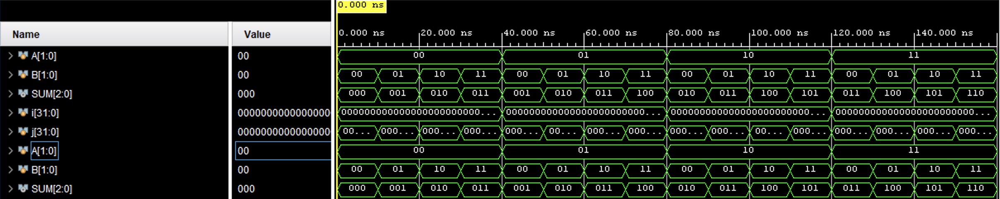

# 2-bit Adder (Verilog)

A simple 2-bit adder written in Verilog with a testbench.

## Files
- `rtl/two_bit_adder.v` — Design file.
- `tb/two_bit_adder_tb.v` — Testbench file.

## How to Run in Vivado
1. Open Vivado and create a new project.
2. Add `two_bit_adder.v` to Design Sources.
3. Add `two_bit_adder_tb.v` to Simulation Sources.
4. Run Behavioral Simulation.
5. You should see correct results in the console and waveform.

## Waveform

